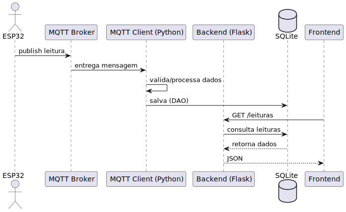

# Documentação do Projeto: Sistema de Monitoramento de Gás

## Modelos (Models)

Modelos representam as entidades do domínio do sistema, cada uma como uma classe Python:
- **Sensor**: id, tipo, localizacao, ativo
- **Leitura**: id, sensor_id, valor, timestamp
- **Alerta**: id, leitura_id, sensor_id, nivel, mensagem, timestamp
- **Dispositivo**: id, mac_address, descricao, online

estão implementadas em `models/`.

Essas classes encapsulam dados e métodos de negócio, como `e_perigosa()` em Leitura.

## DAO (Data Access Object)

DAOs são responsáveis pela persistência (armazenamento/gerenciamento no geral são eles que fazem os comandos SQL e validam os dados antes de registrar no banco) dos dados no banco SQLite. Cada entidade tem um DAO que implementa métodos como:
- `criar_tabela()`: cria a tabela no banco
- `salvar()`: insere ou atualiza registros
- `listar()`: retorna todos os registros
- `buscar_por_id()`: busca registro por id
- `deletar()`: remove registro

O DAO isola a lógica de acesso ao banco, facilitando manutenção e testes.

## Flask

Flask é o framework web usado para criar a API REST. Ele expõe rotas HTTP para manipular as entidades do sistema. Cada rota recebe requisições, valida dados, chama os DAOs e retorna respostas JSON. É organizado em blueprints para modularidade. 
É o flask que permite uma aplicação front-end (web ou app móvel) interagir com o backend via HTTP.

### Blueprint

Blueprint é um recurso do Flask para organizar rotas em módulos. Cada grupo de rotas (ex: sensores, leituras, alertas) fica em um blueprint, facilitando manutenção e escalabilidade.

Exemplo:
```python
leituras_bp = Blueprint("leituras", __name__)
```

## Integração DAO + Flask

O Flask recebe requisições HTTP, chama os métodos dos DAOs para acessar ou modificar dados no SQLite, e retorna o resultado para o cliente. O DAO cuida da persistência, o Flask da interface web.

## MQTT

MQTT é um protocolo leve de mensagens usado para comunicação entre dispositivos IoT e o backend. No projeto:
- **Broker**: Mosquitto, responsável por gerenciar os tópicos e entregar mensagens
- **Tópicos**: Canais de comunicação, ex: `id_dispositivo/sensores/leituras/id_sensor`
- **Payload**: Conteúdo da mensagem, geralmente em JSON
- **Publicação**: Dispositivo envia mensagem para um tópico
- **Subscrição**: Backend escuta (assina) tópicos para receber mensagens

O backend consome mensagens MQTT, processa e salva como leituras ou alertas no banco.

## SQLite

SQLite é o banco de dados usado, simples e leve, ideal para protótipos e aplicações locais. Os DAOs interagem com ele para persistir os dados das entidades.

## Resumo do Fluxo
1. Dispositivo publica leitura/alerta via MQTT no tópico correto
2. Backend Flask (via client MQTT) recebe, processa e salva usando DAOs
3. API REST permite consultar, criar, remover entidades via HTTP
4. Blueprints organizam as rotas
5. SQLite armazena todos os dados

### Diagrama de Fluxo Geral do Sistema


