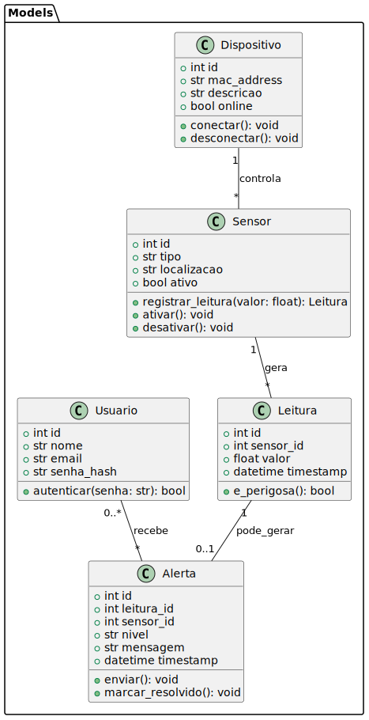

1. Diagrama de CLasses UML de modelo classe


---

2. Estrutura das classes em Python (POO) — esqueleto completo

> Observações: código escrito em estilo idiomático Python. Use database/dao para persistência (ex.: SensorDAO). 
> 
> Aqui usamos classes com métodos de negócio (encapsulamento).


``` python
# models/sensor.py
from datetime import datetime
from typing import Optional

class Sensor:
    def __init__(self, id: Optional[int], tipo: str, localizacao: str, ativo: bool = True):
        self.id = id
        self.tipo = tipo
        self.localizacao = localizacao
        self.ativo = ativo

    def ativar(self):
        self.ativo = True

    def desativar(self):
        self.ativo = False

    def registrar_leitura(self, valor: float, dao):
        # cria uma Leitura e persiste via DAO
        leitura = Leitura(None, self.id, valor, datetime.utcnow())
        dao.leitura_dao.salvar(leitura)
        return leitura

    def to_dict(self):
        return {"id": self.id, "tipo": self.tipo, "localizacao": self.localizacao, "ativo": self.ativo}
```

``` python
# models/leitura.py
from datetime import datetime
from typing import Optional

class Leitura:
    LIMITE_PERIGO = 2000.0  # exemplo — ajustar conforme sensor

    def __init__(self, id: Optional[int], sensor_id: int, valor: float, timestamp: Optional[datetime] = None):
        self.id = id
        self.sensor_id = sensor_id
        self.valor = valor
        self.timestamp = timestamp or datetime.utcnow()

    def e_perigosa(self) -> bool:
        return self.valor >= Leitura.LIMITE_PERIGO

    def to_dict(self):
        return {"id": self.id, "sensor_id": self.sensor_id, "valor": self.valor, "timestamp": self.timestamp.isoformat()}
```

``` python
# models/alarme.py
from datetime import datetime
from typing import Optional

class Alerta:
    def __init__(self, id: Optional[int], leitura_id: int, sensor_id: int, nivel: str, mensagem: str, timestamp: Optional[datetime] = None, resolvido: bool = False):
        self.id = id
        self.leitura_id = leitura_id
        self.sensor_id = sensor_id
        self.nivel = nivel
        self.mensagem = mensagem
        self.timestamp = timestamp or datetime.utcnow()
        self.resolvido = resolvido

    def enviar(self):
        # placeholder: enviar notificação (push, email, etc.)
        pass

    def marcar_resolvido(self):
        self.resolvido = True

    def to_dict(self):
        return {"id": self.id, "leitura_id": self.leitura_id, "sensor_id": self.sensor_id, "nivel": self.nivel, "mensagem": self.mensagem, "timestamp": self.timestamp.isoformat(), "resolvido": self.resolvido}
```

``` python
# models/dispositivo.py
from typing import Optional

class Dispositivo:
    def __init__(self, id: Optional[int], mac_address: str, descricao: str, online: bool = False):
        self.id = id
        self.mac_address = mac_address
        self.descricao = descricao
        self.online = online

    def conectar(self):
        self.online = True

    def desconectar(self):
        self.online = False

    def to_dict(self):
        return {"id": self.id, "mac_address": self.mac_address, "descricao": self.descricao, "online": self.online}
```

``` python
# models/usuario.py
from typing import Optional
import hashlib

class Usuario:
    def __init__(self, id: Optional[int], nome: str, email: str, senha_hash: str):
        self.id = id
        self.nome = nome
        self.email = email
        self.senha_hash = senha_hash

    @staticmethod
    def hash_senha(senha: str) -> str:
        return hashlib.sha256(senha.encode()).hexdigest()

    def autenticar(self, senha: str) -> bool:
        return Usuario.hash_senha(senha) == self.senha_hash

    def to_dict(self):
        return {"id": self.id, "nome": self.nome, "email": self.email}
```

---

3. DAOs e conexão com SQLite (exemplos)

``` python
# database/connection.py
import sqlite3
from sqlite3 import Connection

DB_PATH = "database.db"

def get_connection() -> Connection:
    conn = sqlite3.connect(DB_PATH, check_same_thread=False)
    conn.row_factory = sqlite3.Row
    return conn
```

``` python
# database/sensor_dao.py
from models.sensor import Sensor
from database.connection import get_connection

class SensorDAO:
    @staticmethod
    def criar_tabela():
        conn = get_connection()
        conn.execute("""
        CREATE TABLE IF NOT EXISTS sensores (
            id INTEGER PRIMARY KEY AUTOINCREMENT,
            tipo TEXT NOT NULL,
            localizacao TEXT,
            ativo INTEGER NOT NULL DEFAULT 1
        )
        """)
        conn.commit()
        conn.close()

    @staticmethod
    def salvar(sensor: Sensor) -> Sensor:
        conn = get_connection()
        cur = conn.cursor()
        if sensor.id is None:
            cur.execute("INSERT INTO sensores (tipo, localizacao, ativo) VALUES (?, ?, ?)", (sensor.tipo, sensor.localizacao, int(sensor.ativo)))
            sensor.id = cur.lastrowid
        else:
            cur.execute("UPDATE sensores SET tipo=?, localizacao=?, ativo=? WHERE id=?", (sensor.tipo, sensor.localizacao, int(sensor.ativo), sensor.id))
        conn.commit()
        conn.close()
        return sensor

    @staticmethod
    def listar() -> list:
        conn = get_connection()
        cur = conn.execute("SELECT * FROM sensores")
        sensores = [Sensor(row['id'], row['tipo'], row['localizacao'], bool(row['ativo'])) for row in cur.fetchall()]
        conn.close()
        return sensores
``` 

> DAOs para leituras e alertas seguem o mesmo padrão (criar_tabela, salvar, listar, buscar_por_id, deletar). Use prepared statements e commit/close.
``` sql
---

4. Scripts SQL para criar as tabelas

-- schema.sql
PRAGMA foreign_keys = ON;

CREATE TABLE IF NOT EXISTS dispositivos (
  id INTEGER PRIMARY KEY AUTOINCREMENT,
  mac_address TEXT UNIQUE NOT NULL,
  descricao TEXT,
  online INTEGER DEFAULT 0
);

CREATE TABLE IF NOT EXISTS sensores (
  id INTEGER PRIMARY KEY AUTOINCREMENT,
  dispositivo_id INTEGER,
  tipo TEXT NOT NULL,
  localizacao TEXT,
  ativo INTEGER DEFAULT 1,
  FOREIGN KEY (dispositivo_id) REFERENCES dispositivos(id) ON DELETE SET NULL
);

CREATE TABLE IF NOT EXISTS leituras (
  id INTEGER PRIMARY KEY AUTOINCREMENT,
  sensor_id INTEGER NOT NULL,
  valor REAL NOT NULL,
  timestamp TEXT NOT NULL,
  FOREIGN KEY (sensor_id) REFERENCES sensores(id) ON DELETE CASCADE
);

CREATE TABLE IF NOT EXISTS alertas (
  id INTEGER PRIMARY KEY AUTOINCREMENT,
  leitura_id INTEGER,
  sensor_id INTEGER,
  nivel TEXT,
  mensagem TEXT,
  timestamp TEXT NOT NULL,
  resolvido INTEGER DEFAULT 0,
  FOREIGN KEY (leitura_id) REFERENCES leituras(id) ON DELETE SET NULL,
  FOREIGN KEY (sensor_id) REFERENCES sensores(id) ON DELETE SET NULL
);

CREATE TABLE IF NOT EXISTS usuarios (
  id INTEGER PRIMARY KEY AUTOINCREMENT,
  nome TEXT NOT NULL,
  email TEXT UNIQUE NOT NULL,
  senha_hash TEXT NOT NULL
);
``` 